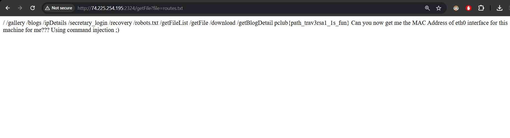
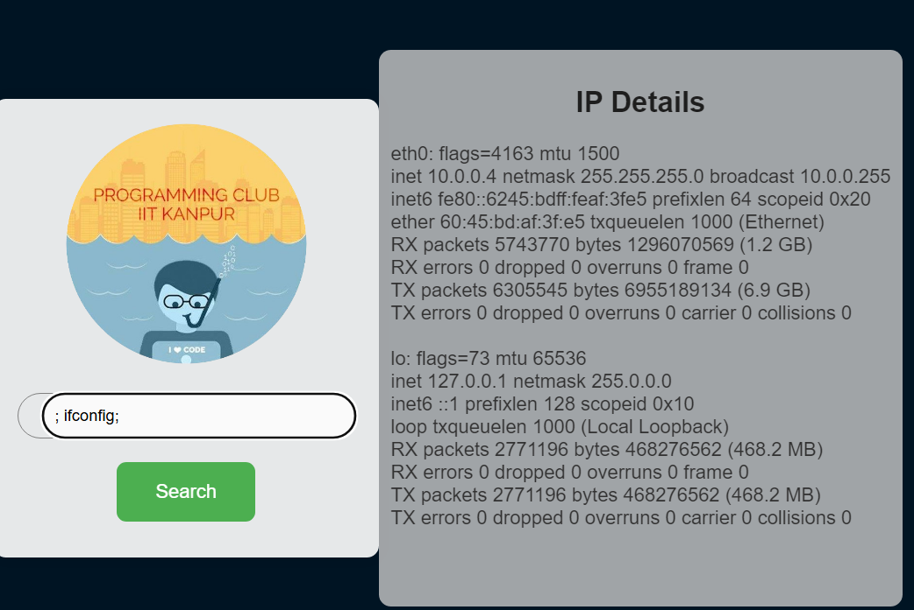

# CTF
writeups to the CTF task

On opening one of the images in gallery in new tab we can see http://74.225.254.195:2324/getFile?file=/home/kaptaan/PClub-DVWA/static/images/gallery/4.jpeg

The http://74.225.254.195:2324/getFile?file= is vulnerable, we can replace the file of image with routes.txt to get 
pclub{path_trav3rsa1_1s_fun} 
The IP details page is vulnerable to injection attacks

we got the mac details: 60:45:bd:af:3f:e5

